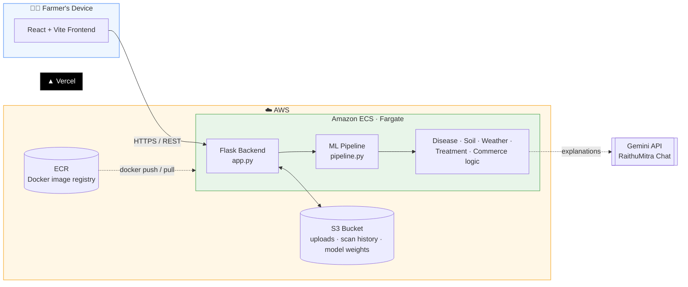
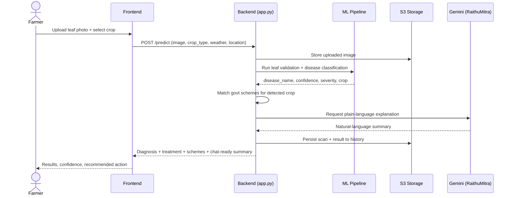
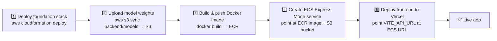

# 🌾 AgroVision AI v3 — Intelligent Crop Disease Detection Platform

> AI-powered crop diagnosis, treatment recommendations, and farm intelligence — deployed live on AWS + Vercel.

[]()
[]()
[]()
[]()

---

## 📐 Architecture



---

## 🔬 Scan → Diagnosis → Recommendation flow



---

## ✨ What's New in v3

| Area | Highlights |
|---|---|
| 🔐 **Authentication** | Real Sign In / Sign Up (no more demo mode); accounts stored with name, email, phone, state; logged-in user shown in sidebar |
| 🌾 **Crop Type** | Frontend crop selector now flows through to `pipeline.py` — results say "Tomato: Leaf Blight", not just "Diseased" |
| 🍃 **Leaf Validator** | OpenCV Haar Cascade face detection hard-rejects human faces; tighter brown/yellow thresholds reject food/objects/sky |
| 🤖 **AI / Chat** | Anthropic key removed — Gemini only, with `2.5-flash → 2.0-flash → 1.5-flash` fallback chain |
| 🏛️ **Govt Schemes** | Route bug fixed; 5 new schemes (PMKSY, PKVY, RKVY, NMOOP, MIDH); new `/schemes/for-crop` auto-match endpoint |
| 📅 **Crop Calendar** *(new)* | Phase-wise guide for 5 crops with monthly tasks + risk levels, auto-selected from last scan |
| 📈 **Yield & Profit Estimator** *(new)* | MSP-based revenue/cost/ROI forecast from pH, rainfall, fertilizer, irrigation, severity — 8 crops |
| 🔄 **Dashboard** | Live refresh, quick-access feature cards, personalized greeting |

---

## 🚀 Quick Start (Local Development)

### Backend

```bash
cd backend
python3.11 -m venv venv
source venv/bin/activate        # Windows: venv\Scripts\activate
pip install -r requirements.txt
# edit .env — add your GEMINI_API_KEY
python app.py
```

### Frontend

```bash
cd frontend
npm install
# edit .env — set VITE_API_URL=http://localhost:5001
npm run dev
```

---

## ⚙️ Environment Variables

**`backend/.env`**

| Variable | Required | Notes |
|---|---|---|
| `PORT` | — | defaults to `5000` |
| `GEMINI_API_KEY` | ✅ | powers RaithuMitra chat |
| `OPENWEATHER_API_KEY` | optional | falls back to mock data if empty |
| `GOOGLE_PLACES_API_KEY` | optional | empty = no supplier suggestions |

**`frontend/.env`**

| Variable | Required |
|---|---|
| `VITE_API_URL` | ✅ — e.g. `http://localhost:5001` |

---

## 🗂️ Project Structure

```mermaid
flowchart TB
    root["📁 agroaws/"]
    root --> fe["📁 frontend/"]
    root --> be["📁 backend/"]
    root --> infra["📁 infra/"]
    root --> deploy["📄 DEPLOY.md"]

    fe --> fe1["pages/AuthPage.jsx — sign in/up"]
    fe --> fe2["pages/ScanPage.jsx — upload → pipeline"]
    fe --> fe3["pages/AnalysisPage.jsx — results + schemes"]
    fe --> fe4["pages/CropCalendarPage.jsx"]
    fe --> fe5["pages/YieldEstimatorPage.jsx"]
    fe --> fe6["pages/GeoMapPage.jsx"]
    fe --> fe7["pages/HistoryPage.jsx"]
    fe --> fe8["pages/ChatPage.jsx — RaithuMitra"]

    be --> be1["app.py — API routes"]
    be --> be2["pipeline.py — ML pipeline"]
    be --> be3["leaf_validator.py — face/leaf gating"]
    be --> be4["schemes_data.py — 13 govt schemes"]
    be --> be5["models/ — .keras + .pkl weights"]

    infra --> in1["cloudformation.yaml — ECR + S3 + IAM"]
```



---

## 🏗️ Deployment

Full walkthrough: **[`DEPLOY.md`](./DEPLOY.md)** · One-command foundation stack: **[`infra/cloudformation.yaml`](./infra/cloudformation.yaml)**



Stack: **Amazon ECS (Fargate, Express Mode)** for the backend container · **Vercel** for the frontend · **S3** for uploads, scan history, and model weights · **ECR** for the Docker image.

---

## 🧠 Patent-Style Features

- Multi-modal leaf disease detection (image + environmental context)
- Reinforcement-learning recommendation engine
- Geo-intelligence outbreak prediction
- 7-day disease progression forecasting
- Adaptive weight feedback loop (auto-retraining)
- Treatment comparison with value scoring
- Explainability (XAI) factors surfaced per diagnosis
- Automated end-to-end decision pipeline
- Crop-matched government scheme surfacing
- Crop calendar with disease-risk overlay
